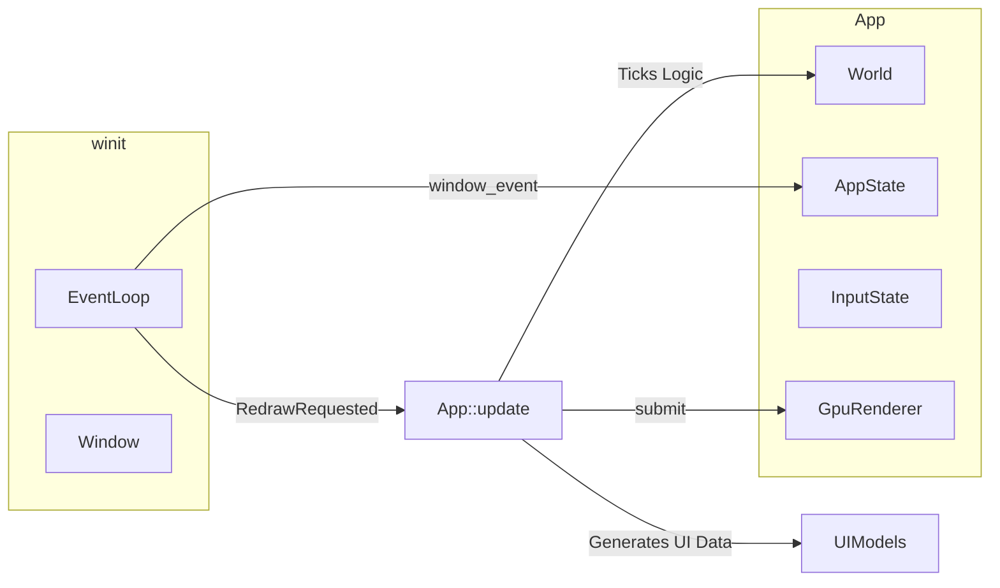

# BangBang — Architecture

## Overview

Rust game with **ECS** (hecs), **GPU** 2D rendering (**wgpu**), and **winit** for windowing. A high-level **state machine** (`AppState`) drives Overworld, Dialogue, and Duel modes. The architecture focuses on **data-driven** configuration, strict **separation of update vs. rendering**, and **explicit error handling**.

## Tech Stack

| Layer | Crate | Role |
|-------|--------|------|
| Window / events | `winit` | Event loop, window surface, raw input |
| GPU / presentation | `wgpu` | Render pipelines, textures, instanced quad batching |
| ECS | `hecs` | Entities, components, world |
| Math | `glam` | Vec2, transforms |
| Config / data | `serde`, `serde_json` | Map data, NPC configs ([docs/npc.md](npc.md)), Skills, Dialogue, UI Theme |
| Logging | `log`, `env_logger` | Diagnostics, deprecation warnings |

## Crate Layout

```text
src/
├── main.rs              # Entry; App (nested GameState, MapContext, RenderConfig, Resources, TransientUi), winit loop
├── lib.rs               # Module declarations
├── config.rs            # NpcConfig, MapDoor, CharacterNpcConfig; GameConfig (assets/game.json: start_map, seed flags, window title)
├── constants.rs         # Shared game constants (NPC_INTERACT_RANGE, door cooldown)
├── render_settings.rs   # GPU/window scales, ui_scale, font_scale (assets/config.json)
├── paths.rs             # Centralized I/O paths (`asset_root()`, `save_game_file()`)
├── save_game.rs         # JSON save/load snapshot (map, player, `WorldState`, NPC HP); see `docs/game.md`
├── map_loader.rs        # load_map(id) → Result<MapData, MapLoadError>
├── map.rs               # Tilemap, TilePalette, collision lookup
├── assets.rs            # AssetStore (cached textures/fonts)
├── ecs/
│   ├── mod.rs           # Core ECS types (Transform, Sprite, AnimationState...)
│   ├── components.rs    # Game components (Health, Backpack)
│   └── world.rs         # setup_world, map transition helpers (carryover, despawn all)
├── dialogue/
│   ├── mod.rs           # Execution engine (current_display, advance)
│   ├── tree.rs          # JSON structure (Node, Branch, choices, effects)
│   └── loader.rs        # I/O load
├── skills/
│   ├── mod.rs           # Application logic (deal_damage, heal)
│   ├── defs.rs          # json schema (SkillDef)
│   ├── registry.rs      # SkillRegistry (auto-discovers assets/skills/*.json)
│   └── backpack_view.rs # Hotkeys, UI formatting
├── gpu/
│   ├── renderer.rs      # GpuRenderer: wgpu pipelines, new/resize/upload, draw_frame orchestration
│   ├── frame_context.rs # FrameContext, RenderScales, UiFrameState, DebugOverlay (per-frame draw inputs)
│   ├── pass_common.rs   # GpuVertex, SubBatch, PassFrameParams shared by passes
│   ├── pass_tilemap.rs  # Tilemap batch
│   ├── pass_entities.rs # Y-sorted entities + dialogue portrait
│   ├── pass_ui.rs       # HP, dialogue panel, toast (delegates backpack)
│   ├── pass_backpack.rs # Backpack slots and skill icons
│   ├── pass_debug.rs    # Debug HUD quads (feature-gated caller)
│   ├── pass_entity_debug.rs # Per-sprite borders + coord labels (`--features debug`)
│   ├── text_atlas.rs    # fontdue TTF → dynamic RGBA atlas
│   └── shader.wgsl      # GPU shader
├── ui/
│   ├── mod.rs           # Exposes Theme, Layout
│   ├── theme.rs         # UiTheme (colors as [f32; 3], derived from assets/ui/theme.json)
│   ├── layout.rs        # Screen math and bounding boxes from ui_scale
│   └── backpack.rs      # Extracted UI model strings (BackpackPanelLines)
├── render/
│   ├── mod.rs           # Wang autotile lookup (WANG16_SHEET_LUT), facing→sprite row, render scale types
│   └── color.rs         # sRGB → packed u32, packed RGB → linear (GPU path)
└── state/
    ├── mod.rs           # Combines AppState, InputState, WorldState
    ├── app.rs           # Overworld | Dialogue | Duel enum
    ├── input.rs         # Raw window input translator (key strokes → semantic actions)
    ├── overworld.rs     # Movement & proximity → NpcInteraction
    ├── map_transition.rs # Door rects → poll_map_door_transition (optional require_state / deny_message)
    └── world.rs         # Persistent player choices (WorldState flags/paths/quests)
```

## Data Flow



1. **Bootstrap**: `main` loads `GameConfig` from `assets/game.json` (start map id, optional demo backpack seed, window title), `render_settings::load()`, then `load_map` for the configured start map. `SkillRegistry::load_builtins` requires a readable `assets/skills/` with at least one `.json` skill. Maps to `hecs::World` and optionally seeds player inventory.
2. **Update vs Render**: `RedrawRequested` triggers `App::update(dt)`, which consumes inputs, runs ECS physics/logic, handles dialogue tree states, and optionally prepares side-channel UI data like `BackpackPanelLines`. Afterwards, `App::draw()` builds a `gpu::FrameContext` and calls `gpu::GpuRenderer::draw_frame(&FrameContext { ... })`. For **minimal always-on HUD** (e.g. player HP bar), the renderer may perform a **read-only** `World` query to read a few scalars; avoid building large UI models or running game logic there (see [docs/antipatterns.md](antipatterns.md)).
3. **GPU Render Passes**: The renderer runs distinct batches (Tilemap → Entities → optional debug borders → UI Overlays → Debug HUD text). The **entity pass** Y-sorts draw order: larger world **Y** (further “south”) draws later so the player can appear in front of building props when standing south of them. [`MapProp`](../src/ecs/components.rs) and [`DoorMarker`](../src/ecs/components.rs) use **sprite center** as the sort depth; actors use the **bottom** of the sprite quad (approximate feet).

### Debug overlay

Building with **`--features debug`** enables compile-time-only developer drawing (no in-game toggle):

- **Per-entity overlays:** [`pass_entity_debug`](../src/gpu/pass_entity_debug.rs) draws a **red** screen-space border around each sprite AABB (same geometry as [`draw_entities_pass`](../src/gpu/pass_entities.rs) via shared `compute_sprite_layout_and_payload`) and a **black** `"{:.1},{:.1}"` label for world `Transform.position`. Borders are encoded **after** world sprites and **before** UI panel quads (`white_over`). Labels are queued into the font batch **before** regular UI text and **before** the FPS/tile [`DebugOverlay`](../src/gpu/frame_context.rs) lines so they sit under panels and the debug HUD.
- **HUD:** `pass_debug::draw_debug_pass` draws [`DebugOverlay`](../src/gpu/frame_context.rs) (smoothed FPS plus extra lines). That overlay text is built in **`main.rs`** from the player `Transform` and current [`Tilemap`](../src/map.rs) (`tile_coords_for_world`, palette `walkable` / `color`, `is_blocking`). Entity borders/labels do **not** depend on `DebugOverlay` being `Some`.

See [docs/game.md](game.md) and [docs/ui.md](ui.md).

## Subsystems & Paradigms

1. **Explicit Errors**: All loading functions bubble `Result<T, E>` up to `main.rs`, preventing silent fallback cascades and making missing files extremely obvious.
2. **Data-Driven Skills**: Adding a skill to `assets/skills/` is required at startup (empty or unreadable directory fails load). `SkillRegistry` also exposes iteration helpers for tools and future UI. 
3. **Story-Driven Dialogue**: NPCs carry an `Npc` component mapped to a string `conversation_id`. The dialogue engine evaluates game `WorldState` dynamically (flags, paths, quests) and supports conversation-level gating via `require_state`. ECS components hold identities, not static string files.
4. **Decoupled UI**: The `ui` module calculates generic layouts and parses themes. The ECS engine passes pre-formatted string lines to the GPU renderer for overlays such as dialogue and backpack. **Trivial HUD** (e.g. HP) may use a single read-only `(&Player, &Health)`-style query in the renderer; heavy formatting and stateful UI stay in `App::update()`.
5. **Typed Interactions**: Overworld collisions bubble a strict `state::overworld::NpcInteraction` structure rather than sprawling native tuples, preventing parameter drift.
