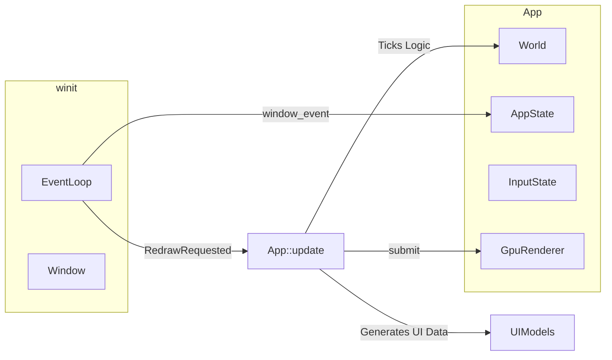

# BangBang — Architecture

## Overview

Rust game with **ECS** (hecs), **GPU** 2D rendering (**wgpu**), and **winit** for windowing. A high-level **state machine** (`AppState`) drives Overworld, Dialogue, and Duel modes. The architecture focuses on **data-driven** configuration, strict **separation of update vs. rendering**, and **explicit error handling**.

## Tech Stack

| Layer | Crate | Role |
|-------|--------|------|
| Window / events | `winit` | Event loop, window surface, raw input |
| GPU / presentation | `wgpu` | Render pipelines, textures, instanced quad batching |
| ECS | `hecs` | Entities, components, world |
| Math | `glam` | Vec2, transforms |
| Config / data | `serde`, `serde_json` | Map data, NPC configs ([docs/npc.md](npc.md)), Skills, Dialogue, UI Theme |
| Logging | `log`, `env_logger` | Diagnostics, deprecation warnings |

## Crate Layout

```text
src/
├── main.rs              # Entry; App with map transitions (doors.json), setup_world, skills, winit loop
├── lib.rs               # Module declarations
├── config.rs            # Raw configuration structs (NpcConfig, MapDoor, CharacterNpcConfig)
├── constants.rs         # Shared game constants (NPC_INTERACT_RANGE, door cooldown)
├── render_settings.rs   # GPU/window scales, ui_scale, font_scale (assets/config.json)
├── paths.rs             # Centralized I/O paths (asset_root())
├── map_loader.rs        # load_map(id) → Result<MapData, MapLoadError>
├── map.rs               # Tilemap, TilePalette, collision lookup
├── assets.rs            # AssetStore (cached textures/fonts)
├── ecs/
│   ├── mod.rs           # Core ECS types (Transform, Sprite, AnimationState...)
│   ├── components.rs    # Game components (Health, Backpack)
│   └── world.rs         # setup_world, map transition helpers (carryover, despawn all)
├── dialogue/
│   ├── mod.rs           # Execution engine (current_display, advance)
│   ├── tree.rs          # JSON structure (Node, Branch, choices, effects)
│   └── loader.rs        # I/O load
├── skills/
│   ├── mod.rs           # Application logic (deal_damage, heal)
│   ├── defs.rs          # json schema (SkillDef)
│   ├── registry.rs      # SkillRegistry (auto-discovers assets/skills/*.json)
│   └── backpack_view.rs # Hotkeys, UI formatting
├── gpu/
│   ├── renderer.rs      # Main wgpu pipeline (draw_tilemap_pass, draw_entities_pass, draw_ui_pass)
│   ├── text_atlas.rs    # fontdue TTF → dynamic RGBA atlas (Regular: dialogue/backpack; Bold: debug HUD)
│   ├── color.rs         # sRGB / packed linear helpers
│   ├── shader.wgsl      # GPU shader
│   └── wang.rs          # Autotile lookup math
├── ui/
│   ├── mod.rs           # Exposes Theme, Layout
│   ├── theme.rs         # UiTheme (colors as [f32; 3], derived from assets/ui/theme.json)
│   ├── layout.rs        # Screen math and bounding boxes from ui_scale
│   └── backpack.rs      # Extracted UI model strings (BackpackPanelLines)
└── state/
    ├── mod.rs           # Combines AppState, InputState, WorldState
    ├── app.rs           # Overworld | Dialogue | Duel enum
    ├── input.rs         # Raw window input translator (key strokes → semantic actions)
    ├── overworld.rs     # Movement & proximity → NpcInteraction
    ├── map_transition.rs # Door rects → poll_map_door_transition
    └── world.rs         # Persistent player choices (WorldState flags/paths/quests)
```

## Data Flow



1. **Bootstrap**: `main` calls `render_settings::load()` and map loading using paths from `crate::paths::asset_root()`. It populates `SkillRegistry` dynamically from folder contents, maps to `hecs::World`, and seeds player inventory.
2. **Update vs Render**: `RedrawRequested` triggers `App::update(dt)`, which consumes inputs, runs ECS physics/logic, handles dialogue tree states, and optionally prepares side-channel UI data like `BackpackPanelLines`. Afterwards, `App::draw()` passes the World and strictly visual data into `gpu::renderer::draw_frame()`.
3. **GPU Render Passes**: The renderer runs distinct batches (Tilemap → Entities → UI Overlays → Debug Overlay).

### Debug overlay

Building with **`--features debug`** enables a developer HUD: [`GpuRenderer::draw_debug_pass`](../src/gpu/renderer.rs) draws [`DebugOverlay`](../src/gpu/renderer.rs) (smoothed FPS plus extra lines). The overlay text is built in **`main.rs`** from the player `Transform` and current [`Tilemap`](../src/map.rs) (`tile_coords_for_world`, palette `walkable` / `color`, `is_blocking`). There is no in-game toggle. See [docs/game.md](game.md) and [docs/ui.md](ui.md).

## Subsystems & Paradigms

1. **Explicit Errors**: All loading functions bubble `Result<T, E>` up to `main.rs`, preventing silent fallback cascades and making missing files extremely obvious.
2. **Data-Driven Skills**: Adding a skill to `assets/skills/` makes it immediately discoverable at runtime. 
3. **Story-Driven Dialogue**: NPCs carry an `Npc` component mapped to a string `conversation_id`. The dialogue engine evaluates game `WorldState` dynamically (flags, paths, quests) and supports conversation-level gating via `require_state`. ECS components hold identities, not static string files.
4. **Decoupled UI**: The `ui` module calculates generic layouts and parses themes. The ECS engine passes pre-formatted string lines to the GPU renderer, shielding the renderer from `hecs::World` queries for pure GUI overlays.
5. **Typed Interactions**: Overworld collisions bubble a strict `state::overworld::NpcInteraction` structure rather than sprawling native tuples, preventing parameter drift.
