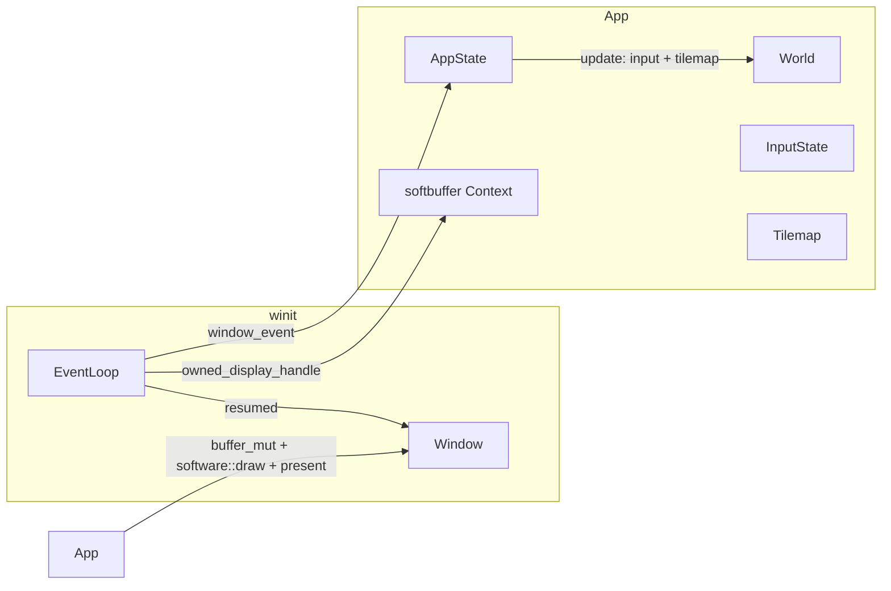

# BangBang — Architecture

## Overview

Rust game with **ECS** (hecs), **CPU-only** 2D rendering (softbuffer), and **winit** for windowing. A high-level **state machine** drives Overworld, Dialogue, and Duel modes. Phase 1 done (CPU renderer, movement, tilemap, collision); dialogue module in place (conversations from `assets/dialogue/{id}.json`, nodes/branches/effects, StoryState-driven).

## Tech Stack

| Layer | Crate | Role |
|-------|--------|------|
| Window / events | winit | Event loop, window, input |
| Software buffer | softbuffer | CPU framebuffer, present to window (no GPU) |
| ECS | hecs | Entities, components, world |
| Math | glam | Vec2, transforms |
| Config / maps | serde, serde_json | Deserialize map.json, npc refs, assets/npc/*.npc.json |

## Crate Layout

```
src/
├── main.rs              # Entry; load_map("intro"), setup_world(world, map_data), App owns tilemap; draw uses app_state.dialogue_message().as_deref()
├── lib.rs               # Re-exports config, dialogue, ecs, map, map_loader, software, state
├── config.rs            # NpcConfig (position, scale, color, conversation_id, dialogue_line) for npc.json
├── map_loader.rs        # load_map(id) → MapData; npc.json refs → assets/npc/{id}.npc.json (conversation_id optional, defaults to id)
├── map.rs               # Tilemap struct (width, height, tiles, tile_size), is_blocking
├── dialogue/
│   ├── mod.rs           # load(), load_or_fallback(), current_display(), advance(); AdvanceResult
│   ├── tree.rs          # Conversation, Node, Branch (serde); node_lines(), one_line(); conditions flag:/path:
│   └── loader.rs        # load(id) from assets/dialogue/{id}.json; load_or_fallback(id, fallback_line)
├── ecs/
│   ├── mod.rs           # World, Transform, Sprite, Player, Npc, Facing, AnimationState, Direction, setup_world
│   ├── components.rs    # Npc (id, conversation_id, dialogue_line); Transform, Sprite, Player, Facing, AnimationState
│   └── world.rs         # setup_world — player + NPCs (Npc with conversation_id, dialogue_line)
├── software.rs          # draw(tilemap, world, dialogue_message: Option<&str>) — tilemap + entities + dialogue box
└── state/
    ├── mod.rs           # AppState, InputState, StoryState
    ├── app.rs           # Overworld | Dialogue { npc_id, conversation_id, fallback_line, node_id, line_index } | Duel; update() uses dialogue::advance/load_or_fallback; dialogue_message() from dialogue module
    ├── input.rs         # InputState (direction, confirm_pressed)
    ├── overworld.rs     # Movement + collision; returns (Option<(npc_id, conversation_id, fallback_line)>, near_npc)
    └── story.rs         # StoryState (path, flags); set_flag, choose_path, has_flag for dialogue conditions/effects
```

**Maps (data):** `assets/maps/{id}.map/map.json` and `npc.json` (refs to `assets/npc/{id}.npc.json`: position, scale, color, optional `conversation_id`, `dialogue_line`). Conversations: `assets/dialogue/{conversation_id}.json` (start node, nodes with line/lines, next, branches with condition, effects).

## Data Flow



1. **Bootstrap**: `main` calls `map_loader::load_map("intro")` to get `MapData` (tilemap, npcs, player_start), creates `World`, runs `ecs::setup_world(world, &map_data)` (spawns player at player_start and NPCs from npcs), builds `App` with `tilemap: Some(map_data.tilemap)`.
2. **Resumed**: First time, `App` creates window (winit) and softbuffer `Context`.
3. **Per frame**: On `RedrawRequested`, `App` calls `AppState::update(world, input, story, dt, tilemap)`. Overworld: movement + collision; if player enters NPC range, switch to `Dialogue { conversation_id, node_id, line_index, ... }` (start node from `dialogue::load_or_fallback`). In Dialogue, confirm calls `dialogue::advance` (page within node or next node, apply effects to StoryState); if finished, return to Overworld. Then `software::draw(..., app_state.dialogue_message().as_deref())` (dialogue text from `dialogue::current_display`), `buffer.present()`.
4. **State**: `AppState` is `Overworld { last_near_npc }` | `Dialogue { npc_id, conversation_id, fallback_line, node_id, line_index }` | `Duel`. Dialogue driver: `dialogue` module + `StoryState`; AppState holds only conversation position.

## Subsystems

### ECS (`ecs`)

- **World**: Single `hecs::World` owned by `App`; created in `main`, passed into `AppState::update`.
- **Components**: `Transform`, `Sprite`, `Player`, `Npc` (id, conversation_id, dialogue_line for fallback when no conversation file), `Facing`, `AnimationState`. Player has Facing + AnimationState; NPCs have Facing.
- **World init**: `setup_world(world, map_data)` spawns player and one entity per `map_data.npcs` (Npc with conversation_id, dialogue_line from config). Map data from `map_loader::load_map(id)`.

### Config (`config`)

- **NpcConfig**: position, scale, color, conversation_id (from character config or NPC id), dialogue_line (fallback for dialogue when conversation file missing). Character files: `assets/npc/{id}.npc.json` with optional `conversation_id`.

### Map loader (`map_loader`)

- **load_map(id)**: Reads `assets/maps/{id}.map/map.json` (width, height, tile_size, tiles, optional player_start) and `assets/maps/{id}.map/npc.json` (array of NPC ref strings). Each ref loads `assets/npc/{id}.npc.json` (single NpcConfig). Returns `MapData { tilemap, npcs, player_start }`. On missing/parse error, returns fallback tilemap and default NPCs.

### Map (`map`)

- **Tilemap**: `width`, `height`, `tiles`, `tile_size`. Tile 0 = walkable, non-zero = blocking. Used by map_loader and overworld collision.

### Software (`software`)

- **CPU renderer**: `draw(buffer, width, height, tilemap, world, dialogue)` clears the buffer, draws the tilemap, then every entity with `Transform` + `Sprite`, then optional dialogue text (bitmap font) when `dialogue` is `Some`. Camera from `Player` + `Transform`. Buffer format: `0x00RRGGBB`. No GPU.
- **Scaling**: Adding more characters or objects requires no renderer change—spawn more entities with `Transform` and `Sprite`. Draw order = query iteration order; add a `Layer`/`ZOrder` component and sort or split draws if you need behind-tiles vs in-front.

### Dialogue (`dialogue`)

- **Conversations**: Load from `assets/dialogue/{conversation_id}.json`. Format: `start` node id, `nodes` map (each: `line` or `lines`, `next` or `branches` with `condition` and `next`, optional `effects`). Conditions: `flag:name`, `path:name` (evaluated against StoryState). Effects: `set_flag:name`, `set_path:name` applied on advance.
- **API**: `load(id)`, `load_or_fallback(id, fallback_line)` (fallback = one-line conversation when file missing), `current_display(conv, node_id, line_index)`, `advance(conv, node_id, line_index, story)` → AdvanceResult (next node_id, line_index, finished). Multi-line nodes: confirm cycles line then next node.

### State (`state`)

- **InputState**: Keyboard (WASD/arrows) → `direction()`; Space/Enter → `confirm_pressed` (consumed by Dialogue).
- **AppState**: `Overworld { last_near_npc }` | `Dialogue { npc_id, conversation_id, fallback_line, node_id, line_index }` | `Duel`. On entering Dialogue, load conversation and set node_id to start. On confirm in Dialogue, call `dialogue::advance`; if finished, return to Overworld else update node_id/line_index. `dialogue_message()` returns `Option<String>` by calling `dialogue::load_or_fallback` and `dialogue::current_display`.
- **overworld**: Movement + tilemap collision; updates Facing and AnimationState. Returns `(Option<(npc_id, conversation_id, fallback_line)>, near_npc)` when player enters NPC range.
- **StoryState**: path, flags; `set_flag`, `choose_path`, `has_flag`; used by dialogue conditions and effects.

## Scaling: more characters and objects

- **Rendering**: Draw loop queries all `(&Transform, &Sprite)`; no per-entity type logic. `Facing` and `AnimationState` are not yet used by the renderer (reserved for sprite-sheet blit: row from Facing, column from AnimationState). New drawables = new entities with those components.
- **Movement**: Overworld mutates entities with `Player` + `Transform` + `Facing` + `AnimationState` (position, facing direction, idle/walk animation). Other entities (NPCs, props) have `Facing` but are passive until you add systems (e.g. `Npc` + AI, or `Interactable`).
- **Camera**: Single player: camera position from the one `Player` + `Transform` entity.
- **Data-driven**: Maps and NPCs are loaded from `assets/maps/{id}.map/map.json` and `npc.json` (refs to `assets/npc/{id}.npc.json`); `setup_world(world, map_data)` spawns player and NPCs. Add more maps or NPC definitions by adding files; no renderer change.
- **Layers**: Current draw order = query order. For layering (e.g. some entities behind tiles), add a component (e.g. `DrawLayer(u8)`) and in `software::draw` sort or run multiple passes (e.g. layer 0, then tilemap, then layer 1).
- **Kinds**: Use marker or data components (`Player`, `Npc`, `Prop`, `Facing`, `SpriteSheet`) so systems and camera can query by role; renderer stays generic (Transform + Sprite, and optional sprite sheet when added).

## Story-driven dialogue and appearance (ECS design)

**Requirements:** NPC (and later player) dialogue and character images must change based on **story path** and **game state** (flags, faction, choices, etc.).

### 1. Game / story state as resources

- Keep **global** story state out of components. Use **resources** (or a single `GameState` / `StoryState` resource) owned by `App` and passed into `update`:
  - Flags: e.g. `met_sheriff`, `duel_lost_intro`, `chose_bandit_path`
  - Faction standings, story branch id, inventory/quest state as needed
- **ECS role:** Systems and dialogue/appearance logic **read** this resource; dialogue choices and consequences **write** to it. No per-entity copy of “the whole story”.

### 2. Leveraging ECS for dialogue

- **Identity:** Give each NPC a stable id (e.g. from map data: `assets/npc/mom.npc.json` → `npc_id: "mom"`). Add an `NpcId(String)` or keep id in a component used only for lookup.
- **Dialogue content:** Replace `Npc::dialogue_line: String` with something like `Npc { npc_id: String, conversation_id: String }`. Dialogue text is **not** stored on the entity; it’s resolved from data.
- **Resolution:** A **story/dialogue module** (outside or alongside ECS) owns:
  - Loading dialogue trees (JSON: nodes, branches, conditions on flags/faction)
  - `resolve_conversation(conversation_id, &GameState) -> current_node` or `resolve_line(npc_id, &GameState) -> String` for simple cases
- **Flow:** When player interacts, Overworld (or a small system) finds the NPC entity and its `conversation_id`; state machine switches to `AppState::Dialogue { conversation_id, node_id, npc_entity? }`. Each frame, dialogue logic uses `GameState` to decide current line, choices, and on confirm applies effects (set flags, change faction) and advances node. So: **ECS holds “who” and “which conversation”;** the **story module + GameState** decide “what is said” and “what happens next”.

### 3. Leveraging ECS for appearance (character / NPC images)

- **Current:** Player has `SpriteSheet { character_id }`; NPCs use `Sprite` (color) only. To support story-driven images, give NPCs (and optionally all characters) a **SpriteSheet**-like component that can be **resolved** from state.
- **Option A – Resolver only:** Keep `SpriteSheet { character_id: String }`. Add a **resource** or **function** `resolve_appearance(character_id, &GameState) -> effective_asset_id` (e.g. `"player"` + flag `after_duel_loss` → `"player_wounded"`). Renderer calls this when drawing: it uses `effective_asset_id` to pick the sheet. No component mutation; logic and data (rules table in JSON) live in a story/appearance module.
- **Option B – System syncs component:** Add optional variant on the component, e.g. `SpriteSheet { character_id: String, variant: Option<String> }`. A **system** `update_appearance(world, &GameState)` runs when entering a map or when `GameState` changes: it queries entities with `SpriteSheet` (and maybe `NpcId` / `Player`), evaluates rules (character_id + GameState → variant), and writes `variant`. Renderer uses `character_id` + `variant` to choose asset (e.g. `assets/characters/{id}/{variant}.png` or `assets/characters/{id}_{variant}/...`). **ECS benefit:** “current appearance” is on the entity; systems can depend on it; no renderer lookup per entity if you cache by (id, variant).

**Recommendation:** Use **Option B** if you want a clear “this entity currently looks like X” in the ECS and simpler renderer logic; use **Option A** if you prefer minimal component changes and central resolution in one place. Both work with a single **GameState** resource and a data-driven table (e.g. JSON: for each `character_id`, list of `{ condition, asset_id_or_variant }`).

### 4. Summary

| Concern | In ECS | Outside ECS |
|--------|--------|--------------|
| Story / game state | Resource: `StoryState` (path, flags) | — |
| Who says what | Component: `Npc { id, conversation_id, dialogue_line }` | `dialogue` module: load from `assets/dialogue/{id}.json`, resolve line from node + StoryState |
| Dialogue flow | `AppState::Dialogue { conversation_id, node_id, line_index }` | `dialogue::advance()`: apply effects to StoryState, return next node or finished |
| Current appearance | Component: `SpriteSheet { character_id }` | (Future) Appearance rules + resolver or system |

This keeps the ECS as the source of “who is where, which conversation, what they look like right now,” while story path and branching are driven by a single global state and data-driven content.

---

## Future Phases (from design)

- **Phase 2**: Duel engine — Effect trait, Gun Power scaling, turn order, win/lose.
- **Phase 3**: Skills & inventory — data-driven skills, charges.
- **Phase 4**: Story & dialogue — dialogue module and conversation JSON in place; next: choices UI, more triggers.
- **Phase 5**: Consequence loop — emergency events on duel loss.
- **Phase 6**: Playable MVP — full loop, polish.

